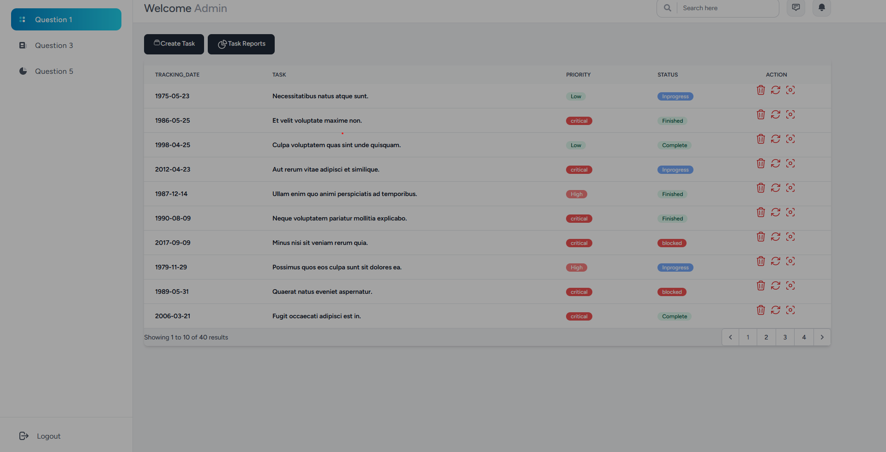
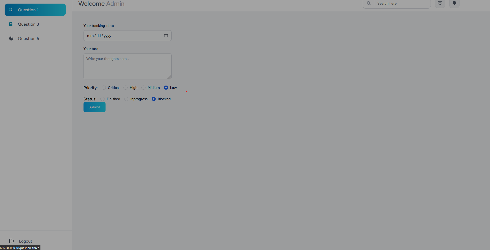
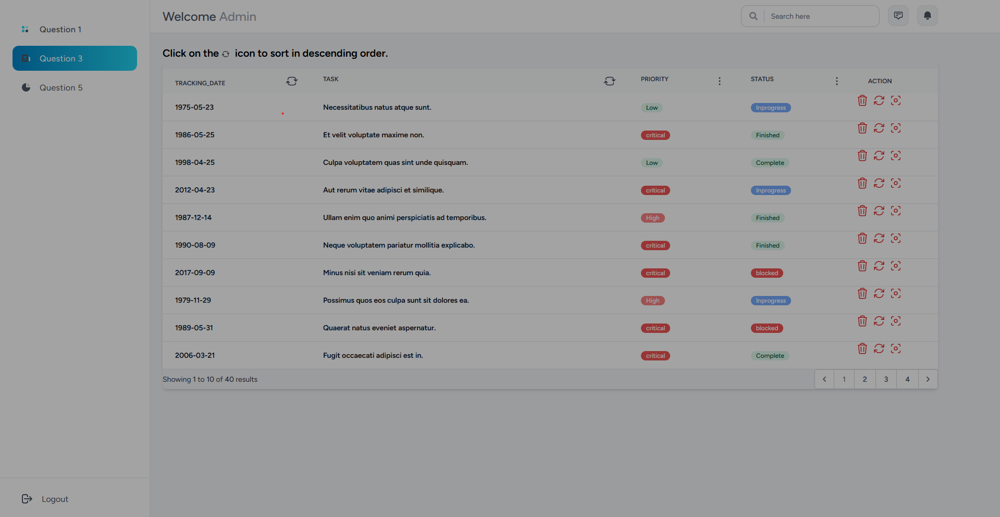
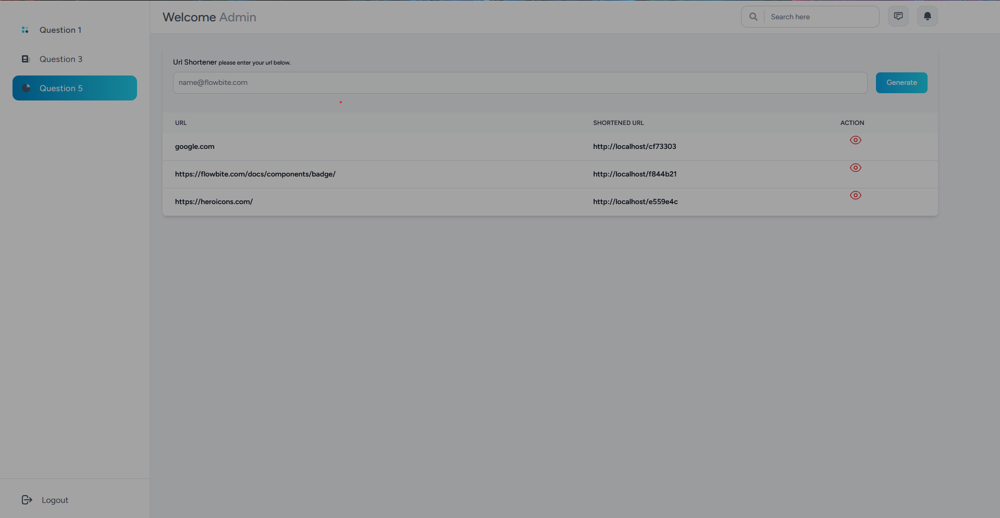

# Junior Dev Practical Test Wambugu Ian

### Requirements
1. Composer
2. MySQL
3. PHP 8
### Installation

#### 0. Intro
Question One.



Question Three


Question Four


#### 1. Clone the repository
```bash
git clone https://github.com/ian-njuguna11/juniour-dev-healthit-pratical-interview
```
#### 2. Install the dependencies
Ensure you have `composer` installed on your computer before proceeding.
Navigate to the root of the project. i.e If you are on linux terminal: `$cd juniour-dev-healthit-pratical-interview`

The run:
```bash
composer install
```

#### 3. Setup environment variables
Create a database for the project in MySQL then configure the parameters `DB_DATABASE`, `DB_USERNAME` and `DB_PASSWORD` in the `.env` file at the project root directory.

#### 4. Run database migration
Make sure configuration is not cached:
```bash
php artisan config:clear
```

Then run migration. This will run database scripts to create database tables:
```bash
php artisan migrate
```

#### 5. Run the application
Run
```bash
php artisan serve

npm run dev
```


A development server will be started running in port `8000`

You can now go to your browser and navigate to `http://localhost:8000` and perform basic CRUD operations on what has been implemented.
